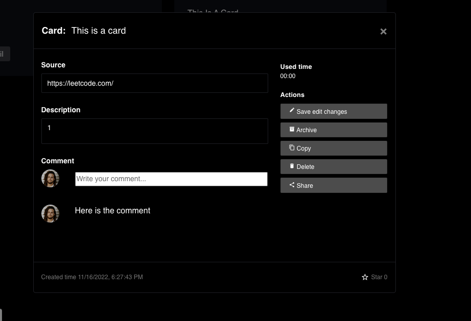

# Card Feature

## Create Card Feature

After you login the website, you can click the green create button and click the new card button.

Then we will show you a modal window, you need to fill the title, the source and also the description, and click create. We will help you create a card.

After successfully the new card, we will close the window automatically. You can create a card from any interface in our website.

## View All Cards Feature

When you click the all cards, you can see all the cards in one page. If you have too many cards, we will display them in different pages.

## View Card Detail Feature

After selecting the view detail button, you can see the card detail.

## Change Card Detail Information

You can click the input field and modify the card title, source and description.

After you modification, you should click the save edit changes to save your modification.

## Delete Card Feature

If you click the delete button and press yes in the notice window, you can delete this card from your collection.

## Share Card to Group Feature

When you click the share button, you will see a list of all the groups you joined. You can select the group you hope to share the card. After you click 'share', you can share the result to those group. And group members can view this card also.

After you share this card, you can not share the same card to the same group again.

## Copy Card Feature 
When you click the Copy button, this card will be copied and a new card with exactly same information will be created in All Cards page.

## Archive Card Feature 
When you click the Archive button, this card will be transferred to Archived Cards tab under navigation.

## Finish Card Feature 
When you click the Finish! button, this card will be transferred to Finished Cards tab under navigation.

