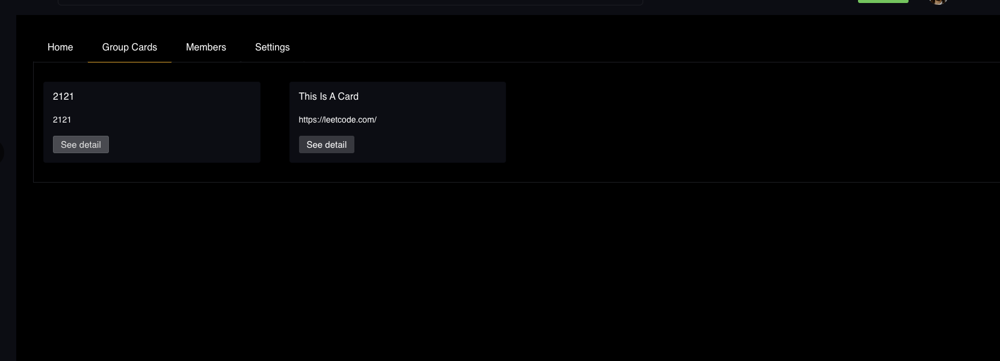
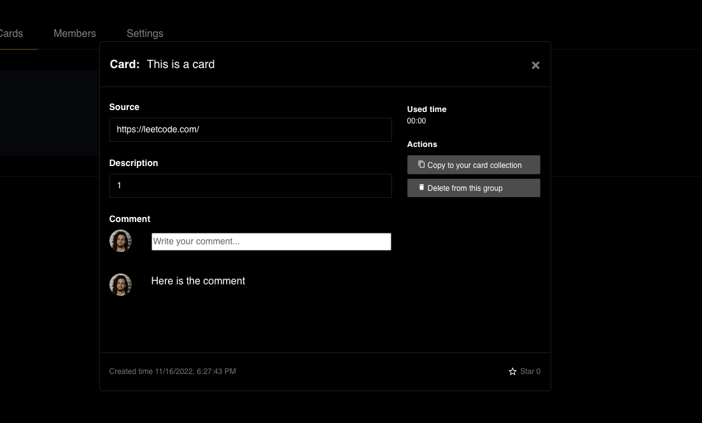
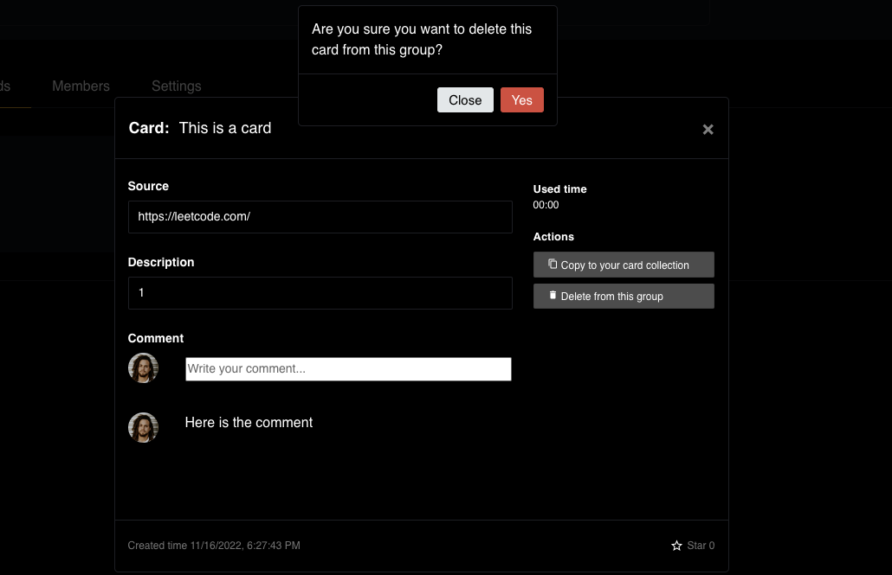
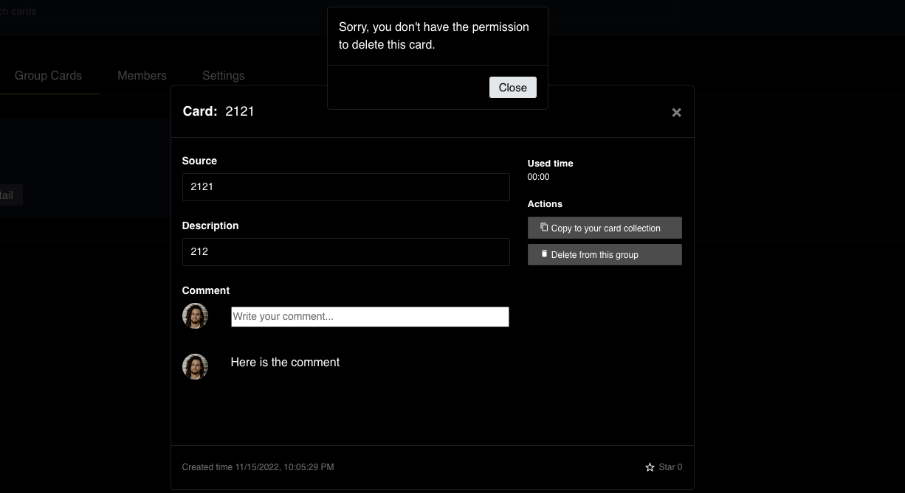

# Group Card Feature

## View Group Card Feature

You can select the group cards tab and view all the cards shared in this group.

You can view the card detail when you click the 'see detail'. However, you can not modify the card detail in this interface.

## Delete card from this group feature

If you are the group owner, group manager or the owner of the card, you can remove the card from the group, or you won't have the permission to do this.

When you click yes, you can remove the card from group. But this card is still exist in your collection.

If you don't have the permission, when you click this button, we will show you the notice to prevent this action.

