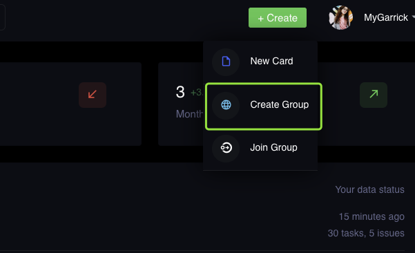
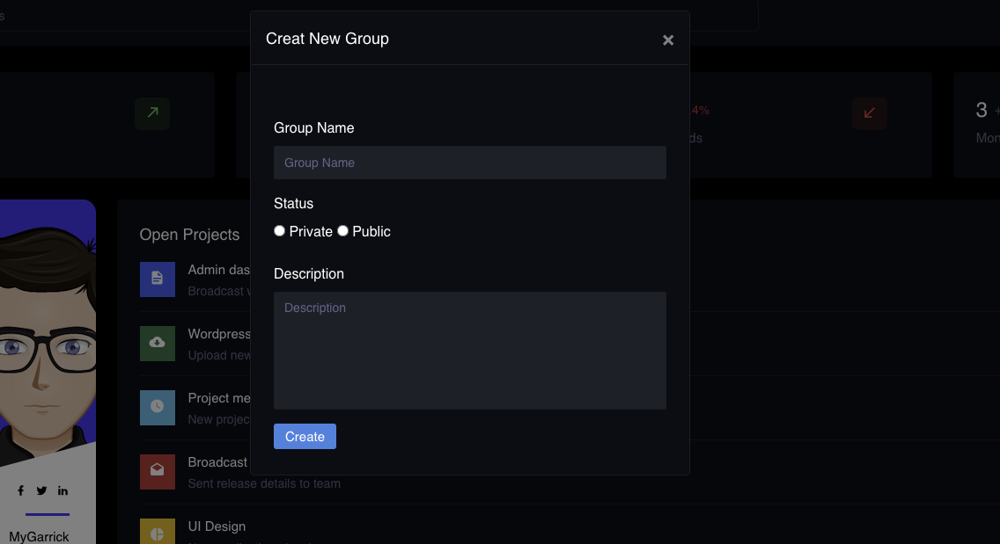
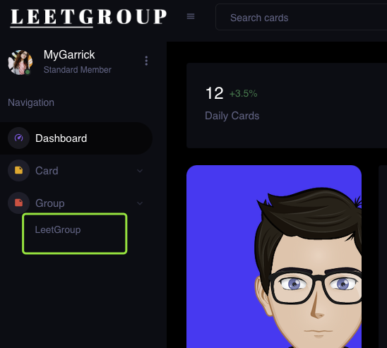
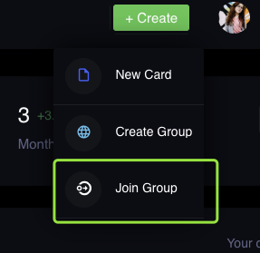
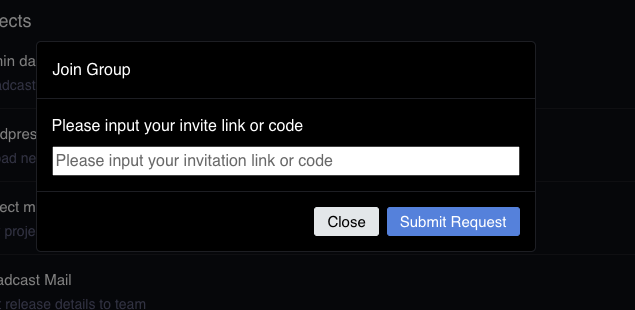
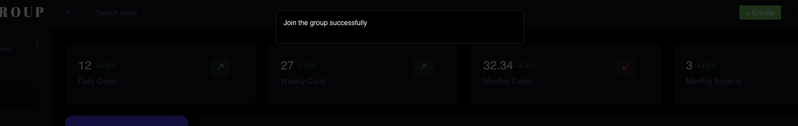
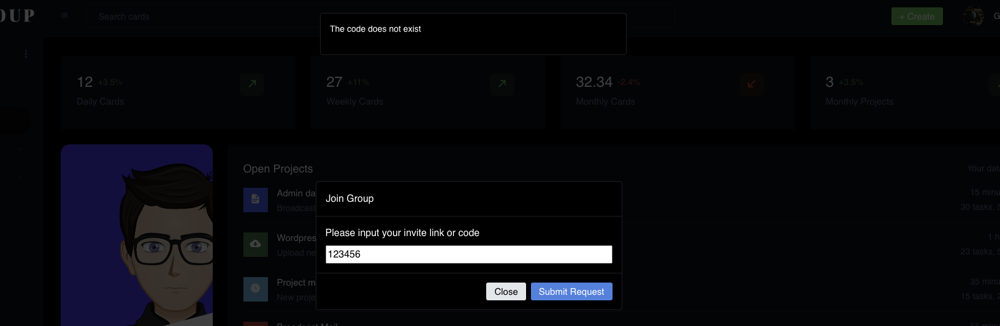
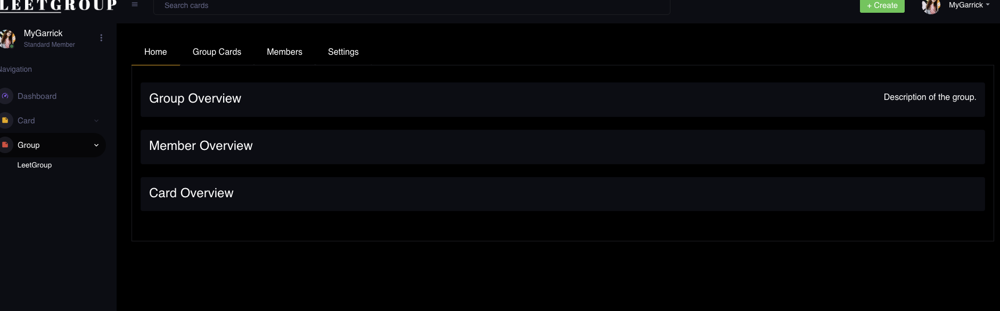
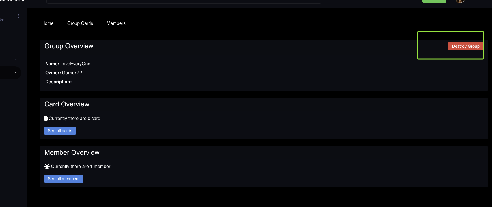
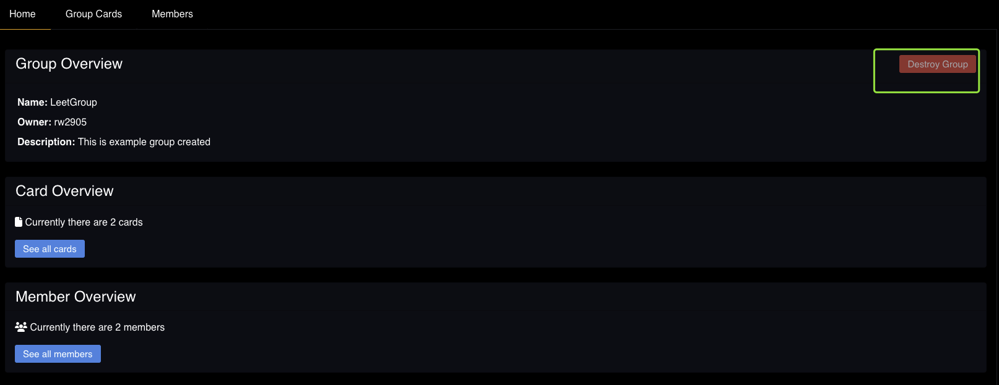

# Group Feature

## Create Group Feature

If you are a new user, then you don't have a group at first. You can try to create a group by click the create group button.

You will see a window to fill you detail, including the group name, group description and group status. If the group is private, then only owner and manager can invite people join group. If the group is public, then every group member can invite member to join the group.

When you create a group successfully, you can see the group under the group tab.

## Join Group Feature

Besides create a group, you can also join one group created by others. There are two ways to join a group:

1.   Firstly, you can click the join group button

     

     Paste the invite code or invite link, and click the submit request, then you can join the group.

     

2.   Secondly, you can paste the invite link on your browser

If the code is correct, you will get the information, and the new group will appear under your group tab.

If you select the second method but didn't sign-in, we will forward you to the login page and let you login firstly.

If the code is private, expired or doesn't exist, we also will show you the notice

## View Group Info

When you click the group name, we will forward you to the group info page. We haven't finish the overview information feature. But you can view and manage group cards, and group members.

## Destroy Group

As a group member, you can click 'Destroy Group' to disassemble this group. After your confirmation, this group won't appeared in your group list, as well your group members'.

However, if you are not the owner, the button is in 'grep red' color which means it's disabled.

