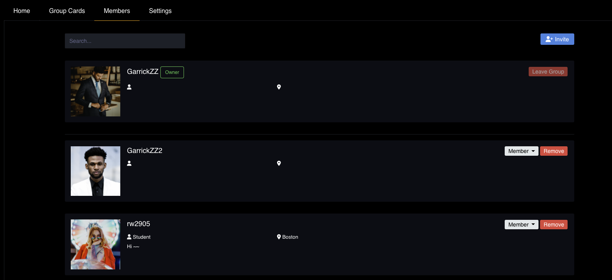
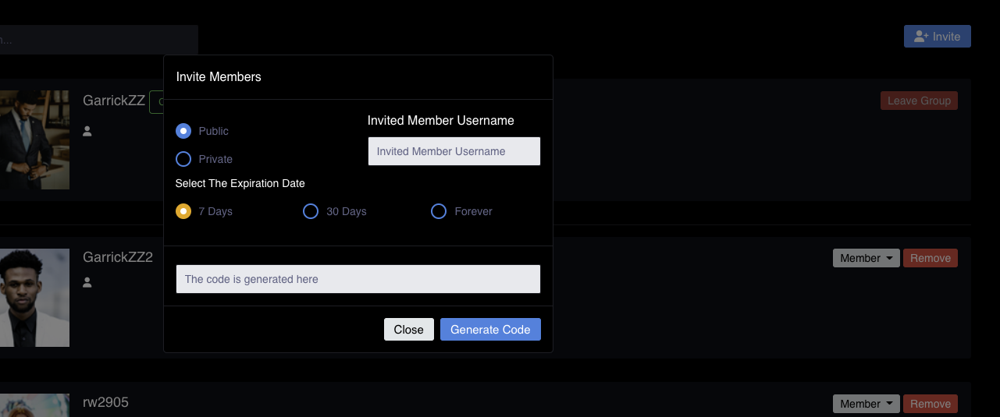
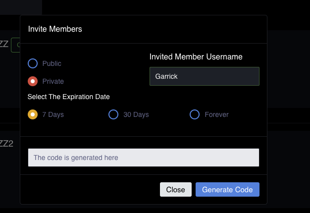
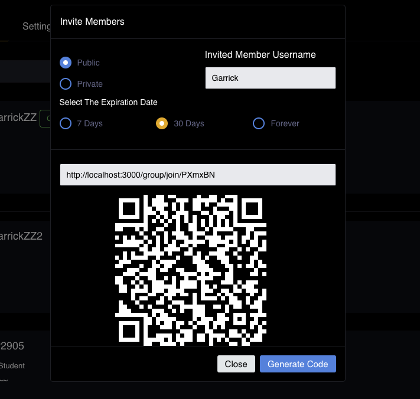
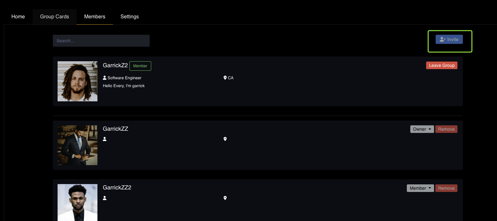
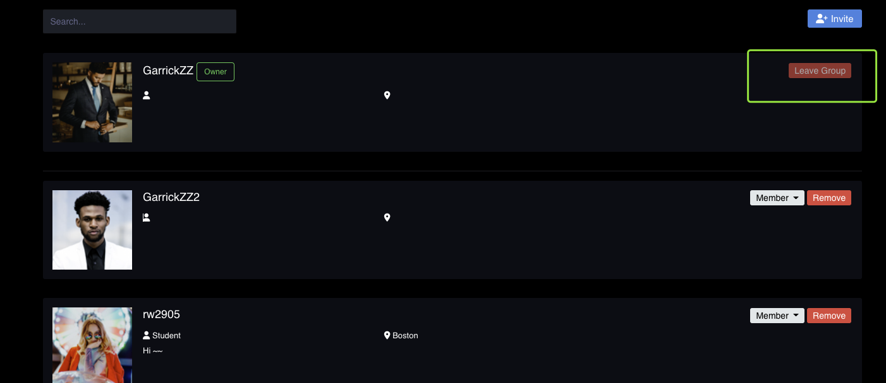
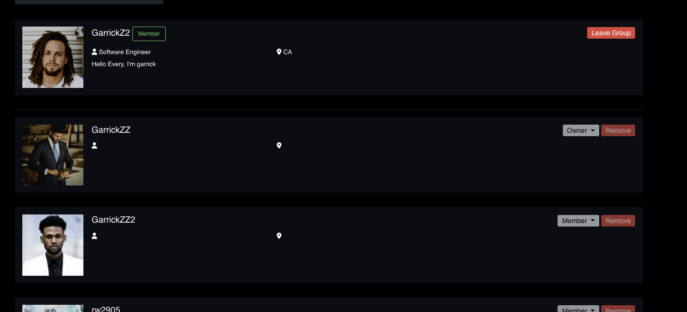
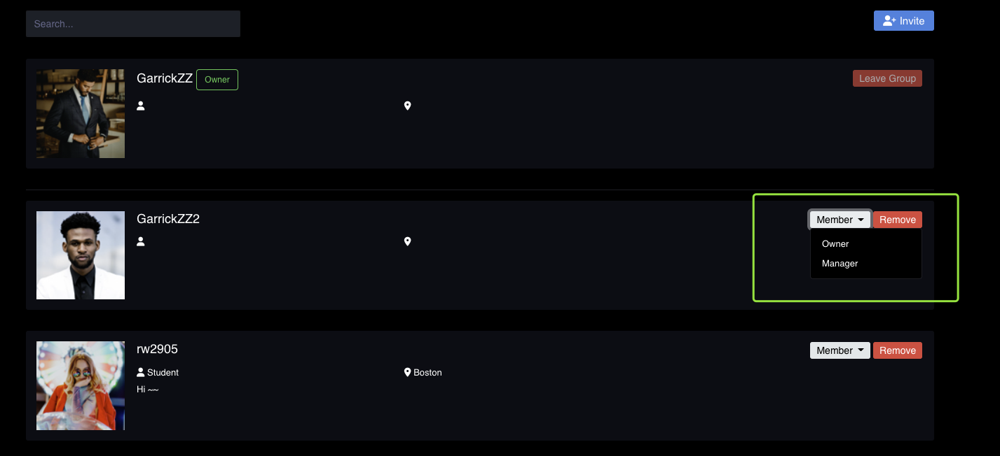
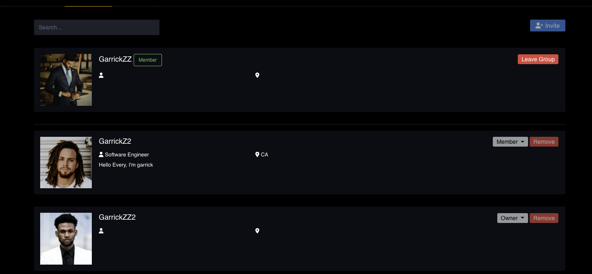

# Group Member Feature

## View Group Members

In the group info page, when you click the members tab, you can view all the members in this group. We will present the username, work-role, city and the bio to you

## Invite Member to Join Group

When you click the invite button, you can view the invite window. You can select to generate a public or private invite code. And also you can select the expiration date (the code will expired after the date)

If you select the public mode, then everyone who has your code can join your group. If you select the private mode, you need to provide the member username, only that member can join your group and only useful for once.

When you click the generate code, we will show you an invite link and qrcode. You can share this link or image to the people who you want to invite.

## Invite Function is disabled in private group

If you are a member in a private group (not owner or manager), then you can not click the invite button.

## Leave Group Feature

Any one who joined this group can also leave the group (except the owner).

You can click the leave group to end the relationship between this group. But all your shared cards still leave in this group. You can clear them before you leave.

After you leave the group, you can re-join the group with new invite link.

However, owner cannot leave the group. The owner can only : a) Disassemble the group or b) Transfer the ownership and leave the group (talk in the change role section)

## Remove Group Member Feature

The Owner and Manager and remove the low-level users out the group.

For example, the owner can remove manager and member out the group. The manager can only remove the member out the group (cannot remove the other manager). The member cannot remove anyone

For example, the remove button for a member is all disabled.

## Change Member Role Feature

Only owner can change the user's role in a group. The users' role can changed among owner, manager and member.

Manager and Member have no rights to change any other user's role

One group can only have one owner. If the owner select another to be the owner, then the old owner will become a member in this group.

The owner can click the role button and select which role he want to assign.

If the owner is selected, the original user will become a member.

