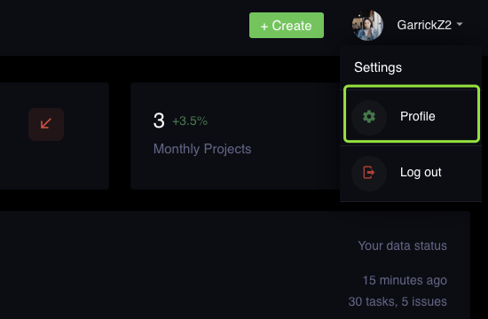
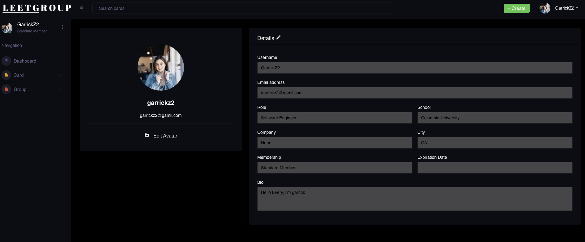
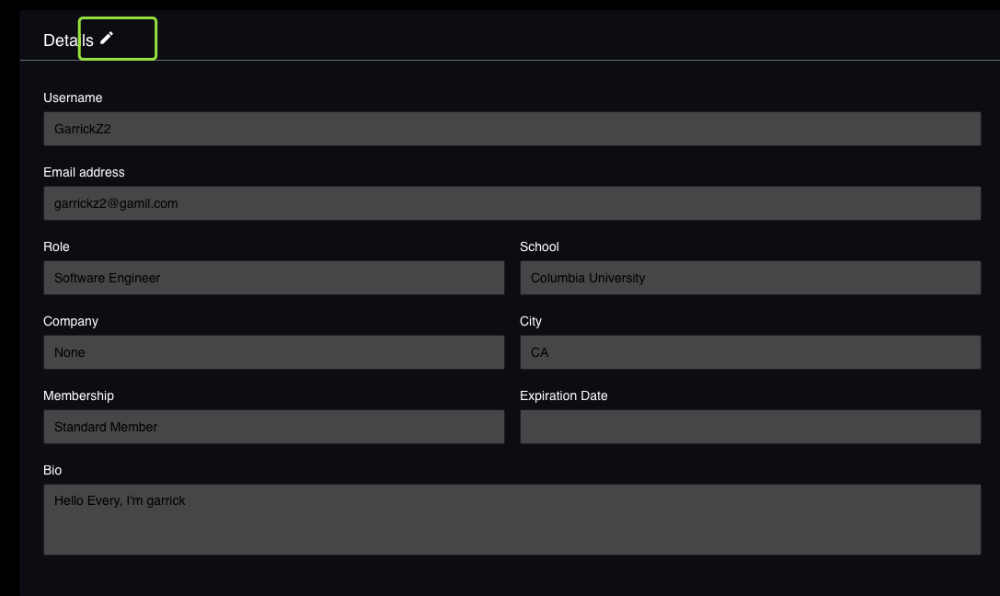
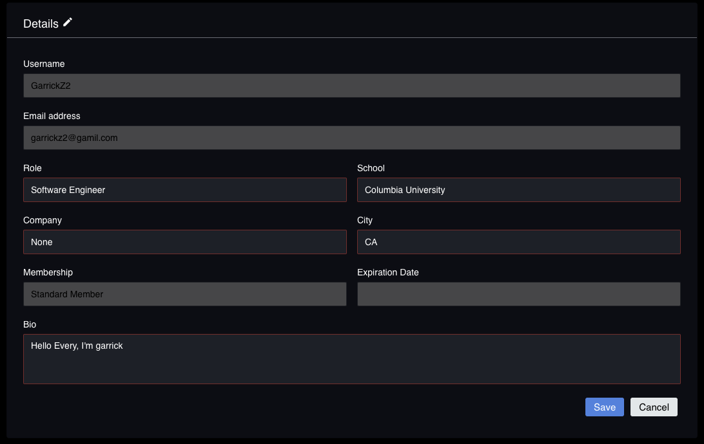
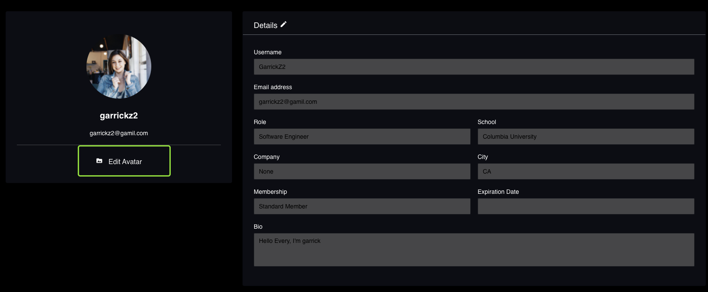
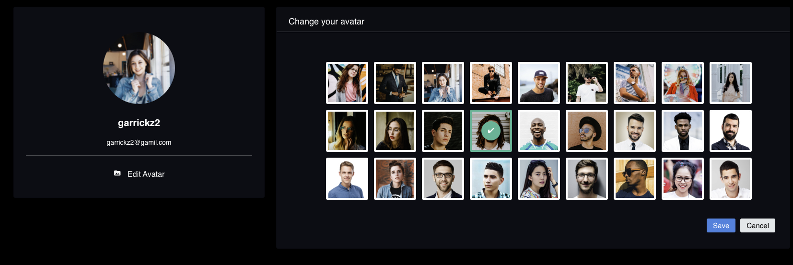
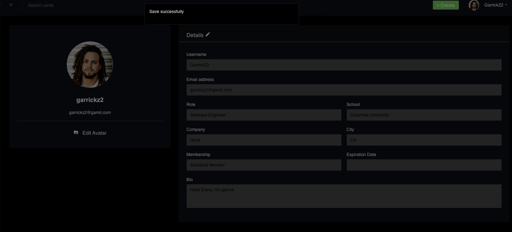
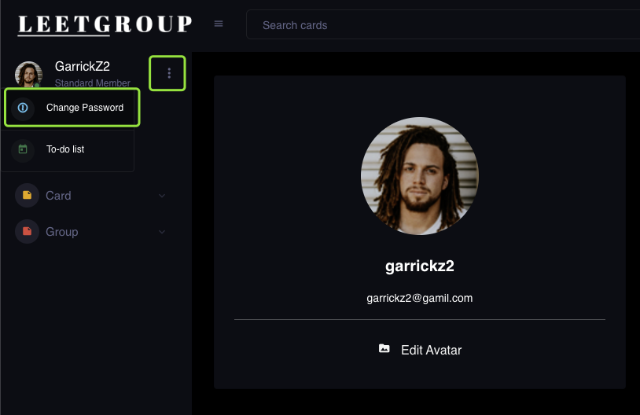
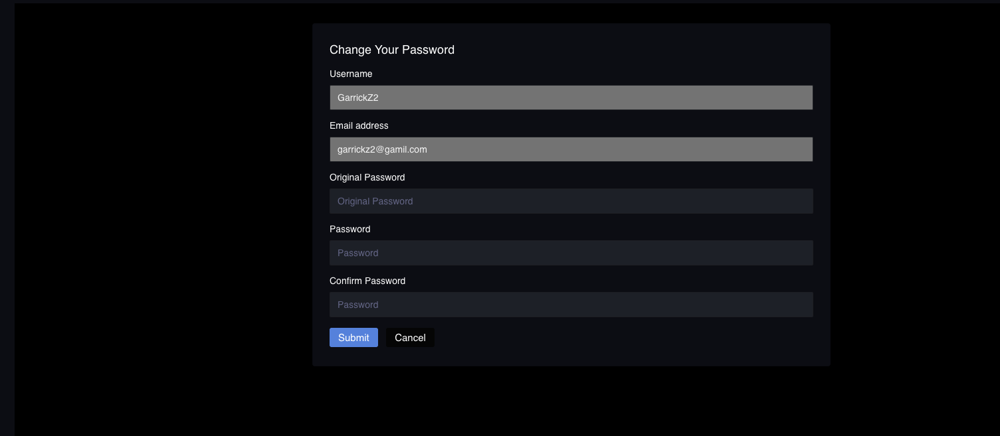

# User Profile Feature

## View Profile Feature

After you log into our website, you can click profile button on the top left corner, then you can goto you profile page and view your information

All the personal information is listed below, and the username, city role and bio will be revealed to the group members.

## Update Profile Information

If you click the pencil button, all the profile fields (besides username, email and membership) will become editable.

You can change your personal information and click save to change your profile information.

## Update your Avatar Image

When you firstly register an account, we will assign a random avatar to you, and you can change it to your favorite one in the avatar edit page.

We haven't provide an image upload function for you. So you can change one from our collection and click save, then you can change the avatar successfully.

## Change Password

On the left top corner, there are three dots. Click the dots, we will show you another menu list, you can change your password there.

If you hope to update your password, you should provide the correct old password, and also the new password and confirmed new password. If they match our password rules, then you can change password successfully.

