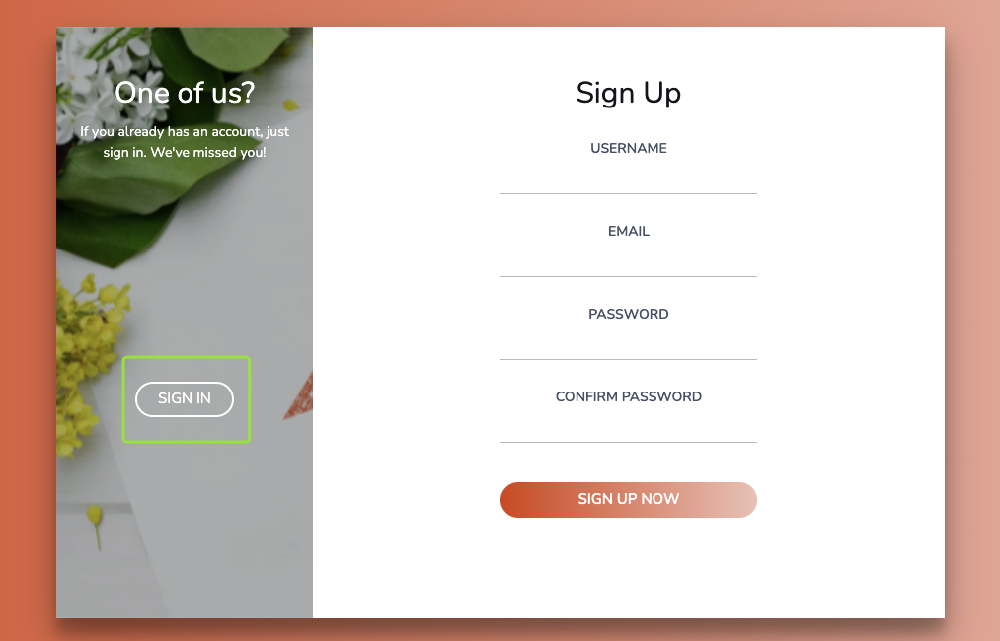
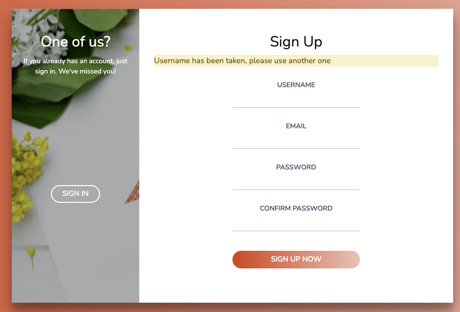
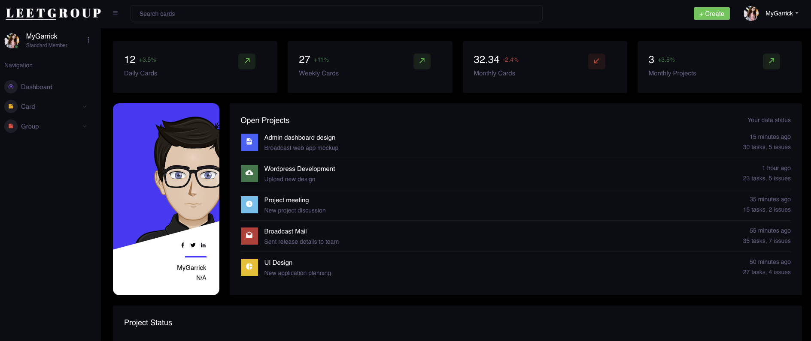
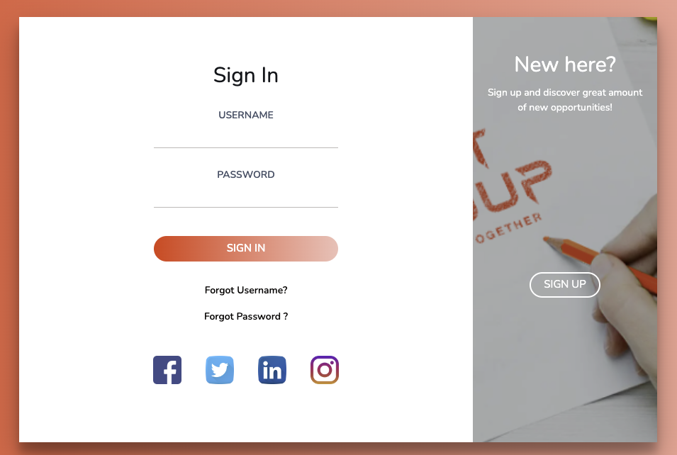
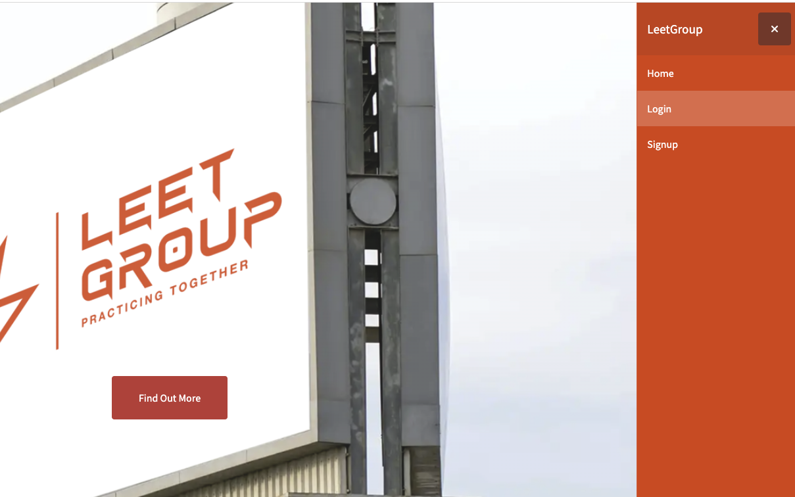
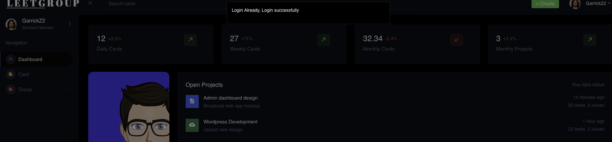
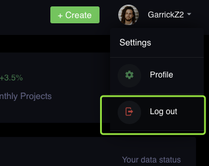
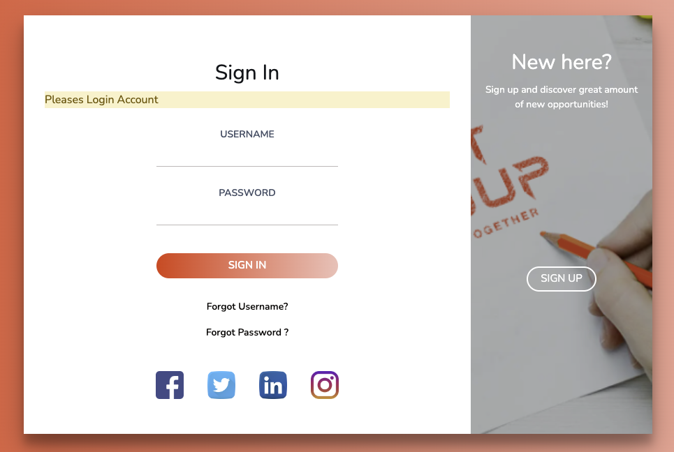

# User Features

## Register Feature

Firstly, click the menu button and then select the signup, you can go to the register page

Then you can sign up your account.

According to our rules:

a) your username should have 6 or more letters

b) your email should be the right format

c) your password should have at least 1 special character, 1 lowercase letter, 1 uppercase letter and 1 digit. The total length should larger than 6

d) the confirm password should be identical with the password

e) email and username should be the unique in our database

If any rules is violated, we will give gentle notice for you

If you register successfully, we will forward you to the main page

## Login Feature

If you click the login in the index page, we will forward you to the sign in page.

If you fill in the correct username and password, we will forward you to the main page, else we will tell you have error in username or password

## Auto Login Feature

If you login previously, and when you click the login button, we will auto-forward you to the main page.

And also, will show you a notice, you have auto login successfully.

However, if you click the signup button, we will you help you logout (if you login already) and forward you to the register page.

## Logout Feature

If you click logout, you will be logout and redirect to login page.

## Authentication Check Feature

If you directly go to our main page (url) without login, we will forward you to the login page and show you the notice " you should login firstly "

